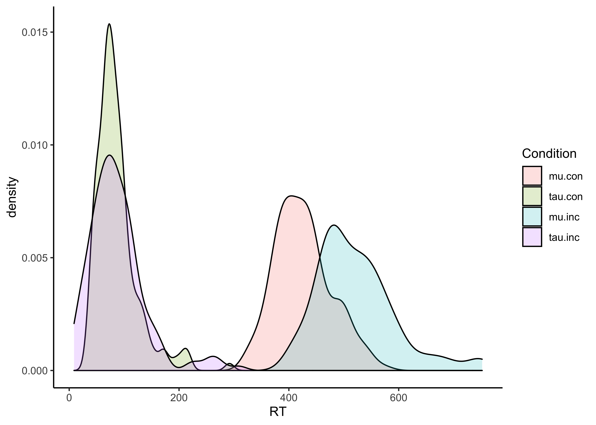

EREC\_ANT
================
Jadyn Park
7/16/2021

Apply ex-Gaussian distribution to Attention Network Task (ANT; Flanker)
data

``` r
# path <- "~/Desktop/EREC/Data Processing & Subject-Level Data/ANT/csv/" # set file path (i.e., the folder that has all the raw subject files)
# fileNames <- dir(path, pattern="*.csv") # tell it what file types to look for
# length(fileNames) # number of files
# 
# directory <- list()
# ## Start of loop
# for (i in 1:length(fileNames)) {
#   ## read in data:
#   directory<- paste0("~/Desktop/EREC/Data Processing & Subject-Level Data/ANT/csv/", fileNames[i])
#   data.fileName <- read.csv(directory, sep=",", header=T)
#   data.cleaned <- data.fileName %>% filter(SlideTarget.ACC==1, is.na(SlideTarget.ACC)==FALSE) # get rid of incorrect and missing trials
#   
#   ## select relevant variables
#   data.fileNamesub <- data.cleaned %>% dplyr::select(ExperimentName, DataFile.Basename, Subject, Session, SlideTarget.ACC, SlideTarget.RT, FlankerType)
#   
#   ## make vectors for RT for correct trials (collapsed across congruent and incongruent) and trial type
#   data.fileNamesub$rt.cor <- ifelse(is.na(data.fileNamesub$`SlideTarget.ACC`) == FALSE, data.fileNamesub$SlideTarget.RT, data.fileNamesub$SlideTarget.RT)
#   
#   data.fileNamesub$TrialType <- rep(NA, nrow(data.fileNamesub)) # create column of NAs that gets filled in with either "Con" or "Incon" in the next 2 lines
#   data.fileNamesub$TrialType[data.fileNamesub$`FlankerType` == "congruent"] <- "Con"
#   data.fileNamesub$TrialType[data.fileNamesub$`FlankerType` == "incongruent"] <- "Incon"
#   
#   # make new dataframes for congruent and incongruent trials
#   data.fileNamesub.con <- subset(data.fileNamesub, TrialType == "Con")
#   data.fileNamesub.inc <- subset(data.fileNamesub, TrialType == "Incon")
#   
# 
#   ## estimate and extract ex-Gaussian parameters for congruent and incongruent trials
#   set.seed(1)
#   fitfileName.con <- timefit(data.fileNamesub.con$rt.cor, iter = 5000, # estimate parameters for congruent trials following Bondy et al. (2017)
#                              size = length(data.fileNamesub.con$rt.cor), replace = TRUE, plot = FALSE)
#   
#   
#   # fitfileName.con <- timefit(data.fileNamesub$rt.cor[data.fileNamesub$TrialType == "Con"], iter = 5000, # estimate parameters for congruent trials following Bondy et al. (2017)
#   #                            size = length(data.fileNamesub$rt.cor[data.fileNamesub$TrialType == "Con"]), replace = TRUE, plot = FALSE)
#   
#   set.seed(1)
#   fitfileName.inc <- timefit(data.fileNamesub.inc$rt.cor, iter = 5000, # estimate parameters for incongruent trials following Bondy et al. (2017)
#                              size = length(data.fileNamesub.inc$rt.cor), replace = TRUE, plot = FALSE)
#   
#   ## combine participant's parameters, SDs, etc. into one row
#   parfileName <- cbind(t(fitfileName.con@par), sd(fitfileName.con@bootPar[,1]), sd(fitfileName.con@bootPar[,2]), sd(fitfileName.con@bootPar[,3]),
#        fitfileName.con@logLik, fitfileName.con@AIC, t(fitfileName.inc@par), sd(fitfileName.inc@bootPar[,1]), 
#        sd(fitfileName.inc@bootPar[,2][fitfileName.inc@bootPar[,2]<10000]), sd(fitfileName.inc@bootPar[,3][fitfileName.inc@bootPar[,3]<10000]), # incongruent SDs EXCLUDING iterations that didn't converge
#        fitfileName.inc@logLik, fitfileName.inc@AIC,
#        sd(fitfileName.inc@bootPar[,2]), sd(fitfileName.inc@bootPar[,3]), # incongruent SDs INCLUDING iterations that didn't converge
#        length(fitfileName.con@bootPar[,2][fitfileName.con@bootPar[,2] >10000]), # number of congruent iterations for which sigma was impossibly high (i.e., > 10000)
#        length(fitfileName.con@bootPar[,3][fitfileName.con@bootPar[,3] >10000]), # number of congruent iterations for which tau was impossibly high (i.e., > 10000)
#        length(fitfileName.con@sigmaValid[fitfileName.con@sigmaValid==FALSE]), # number of congruent iterations for which sigma value was rejected (out of 5000)
#        length(fitfileName.inc@bootPar[,2][fitfileName.inc@bootPar[,2] >10000]), # number of incongruent iterations for which sigma was impossibly high (i.e., > 10000)
#        length(fitfileName.inc@bootPar[,3][fitfileName.inc@bootPar[,3] >10000]), # number of incongruent iterations for which tau was impossibly high (i.e., > 10000)
#        length(fitfileName.inc@sigmaValid[fitfileName.inc@sigmaValid==FALSE])) # number of incongruent iterations for which sigma value was rejected (out of 5000)
#                        
#   ## add ID as row name
#   rownames(parfileName) <- c(data.fileNamesub$DataFile.Basename[1]) 
#   
#   ## write/append output data to separate file:
#   write.table(parfileName, 
#               "~/Desktop/EREC/Data Processing & Subject-Level Data/ANT/Final Dataset.csv",
#               append = TRUE,
#               sep = ",",
#               row.names = TRUE, # include ID as the first column
#               col.names = FALSE)
#   
#   ## Final Dataset won't have column names, but they're easy to add:
#   ## "ID", "mu.con","sigma.con","tau.con","mu.con_sd","sigma.con_sd","tau.con_sd","LogLikelihood.con","AIC.con", "mu.inc","sigma.inc","tau.inc","mu.inc_sd","sigma.inc_sd","tau.inc_sd","LogLikelihood.inc","AIC.inc","sigma.inc_sd.IncludingHigh","tau.inc_sd.IncludingHigh","NumIterHighSigma.con","NumIterHighTau.con","NumIterSigmaRejected.con","NumIterHighSigma.inc","NumIterHighTau.inc","NumIterSigmaRejected.inc"
#   
#   ## print participant IDs as they get run through the loop so you have a sense of how far along the loop is
#   print(data.fileNamesub$DataFile.Basename[1]) 
# }
```

``` r
# Data visualization
data <- read.csv("~/Desktop/EREC/JP Analysis/ANT/ANT_final data.csv", header=T)

# Quick sanity check: RT in con vs. incon trials (expect incon > con RT)
#var.test(data$mu.con, data$mu.inc) # p<.05; heterogeneous sample
t.test(data$mu.con, data$mu.inc, var.equal=F) # inc RT is significantly longer than con RT
```

    ## 
    ##  Welch Two Sample t-test
    ## 
    ## data:  data$mu.con and data$mu.inc
    ## t = -13.765, df = 280.73, p-value < 2.2e-16
    ## alternative hypothesis: true difference in means is not equal to 0
    ## 95 percent confidence interval:
    ##  -110.43779  -82.80314
    ## sample estimates:
    ## mean of x mean of y 
    ##  425.8086  522.4290

``` r
#var.test(data$tau.con, data$tau.inc)
t.test(data$tau.con, data$tau.inc, var.equal=F) # no significant difference in tau RT
```

    ## 
    ##  Welch Two Sample t-test
    ## 
    ## data:  data$tau.con and data$tau.inc
    ## t = -0.13827, df = 290.37, p-value = 0.8901
    ## alternative hypothesis: true difference in means is not equal to 0
    ## 95 percent confidence interval:
    ##  -10.956513   9.518086
    ## sample estimates:
    ## mean of x mean of y 
    ##  87.10467  87.82389

``` r
# Visualizing distribution
clean <- data %>% dplyr::select(Subject, Threat, mu.con, tau.con, mu.inc, tau.inc)

melt <- clean %>% reshape2::melt(id=c("Subject", "Threat"), variable.name="Condition", value.name="RT")

ggplot(melt, aes(x=RT, fill=Condition)) + geom_density(alpha=.2) + theme_classic()
```

<!-- -->

``` r
# reorganize dataset so that there is one row/subject, each subject has 8 var: (1) NS, mu con, (2) NS mu inc, (3) Sh mu con, (4) Sh mu in,
# (5) NS tau con, (6) NS tau inc, (7) Sh tau con, (8) Sh tau inc (2x2 muANOVA, 2x2 tauANOVA)
```

Correlation heatmap PD/A group showed greater startle and corrugator
suppresion in the decrease condition, compared to other two groups

``` r
ant <- read.csv("~/Desktop/EREC/JP Analysis/ANT/ANT_withinsub.csv")

## pda group only
pda <- ant %>% filter(Group==2)

## startle decrease
map_startle_decrease <- pda %>% select(Startle_T_decrease, NS_tau.con, NS_tau.inc, Sh_tau.con, Sh_tau.inc)
map_startle_decrease <- map_startle_decrease %>% drop_na() ## drop rows with NA value

colnames(map_startle_decrease) <- c("Startle\nsuppression", "SAFE\ncongruent", "SAFE\nincongruent", "THREAT\ncongruent", "THREAT\nincongruent") 

map_corr <- Hmisc::rcorr(as.matrix(map_startle_decrease))
data.frame(map_corr$r) %>% head() %>% kable()
```

<table>
<thead>
<tr>
<th style="text-align:left;">
</th>
<th style="text-align:right;">
Startle.suppression
</th>
<th style="text-align:right;">
SAFE.congruent
</th>
<th style="text-align:right;">
SAFE.incongruent
</th>
<th style="text-align:right;">
THREAT.congruent
</th>
<th style="text-align:right;">
THREAT.incongruent
</th>
</tr>
</thead>
<tbody>
<tr>
<td style="text-align:left;">
Startle suppression
</td>
<td style="text-align:right;">
1.0000000
</td>
<td style="text-align:right;">
0.1515492
</td>
<td style="text-align:right;">
-0.2464576
</td>
<td style="text-align:right;">
0.1662225
</td>
<td style="text-align:right;">
0.4246494
</td>
</tr>
<tr>
<td style="text-align:left;">
SAFE congruent
</td>
<td style="text-align:right;">
0.1515492
</td>
<td style="text-align:right;">
1.0000000
</td>
<td style="text-align:right;">
0.6704538
</td>
<td style="text-align:right;">
0.0510694
</td>
<td style="text-align:right;">
0.2216576
</td>
</tr>
<tr>
<td style="text-align:left;">
SAFE incongruent
</td>
<td style="text-align:right;">
-0.2464576
</td>
<td style="text-align:right;">
0.6704538
</td>
<td style="text-align:right;">
1.0000000
</td>
<td style="text-align:right;">
-0.0545166
</td>
<td style="text-align:right;">
0.0939638
</td>
</tr>
<tr>
<td style="text-align:left;">
THREAT congruent
</td>
<td style="text-align:right;">
0.1662225
</td>
<td style="text-align:right;">
0.0510694
</td>
<td style="text-align:right;">
-0.0545166
</td>
<td style="text-align:right;">
1.0000000
</td>
<td style="text-align:right;">
0.6482797
</td>
</tr>
<tr>
<td style="text-align:left;">
THREAT incongruent
</td>
<td style="text-align:right;">
0.4246494
</td>
<td style="text-align:right;">
0.2216576
</td>
<td style="text-align:right;">
0.0939638
</td>
<td style="text-align:right;">
0.6482797
</td>
<td style="text-align:right;">
1.0000000
</td>
</tr>
</tbody>
</table>

``` r
data.frame(map_corr$P) %>% head() %>% kable()
```

<table>
<thead>
<tr>
<th style="text-align:left;">
</th>
<th style="text-align:right;">
Startle.suppression
</th>
<th style="text-align:right;">
SAFE.congruent
</th>
<th style="text-align:right;">
SAFE.incongruent
</th>
<th style="text-align:right;">
THREAT.congruent
</th>
<th style="text-align:right;">
THREAT.incongruent
</th>
</tr>
</thead>
<tbody>
<tr>
<td style="text-align:left;">
Startle suppression
</td>
<td style="text-align:right;">
NA
</td>
<td style="text-align:right;">
0.5897777
</td>
<td style="text-align:right;">
0.3758924
</td>
<td style="text-align:right;">
0.5538038
</td>
<td style="text-align:right;">
0.1146266
</td>
</tr>
<tr>
<td style="text-align:left;">
SAFE congruent
</td>
<td style="text-align:right;">
0.5897777
</td>
<td style="text-align:right;">
NA
</td>
<td style="text-align:right;">
0.0062303
</td>
<td style="text-align:right;">
0.8565651
</td>
<td style="text-align:right;">
0.4272236
</td>
</tr>
<tr>
<td style="text-align:left;">
SAFE incongruent
</td>
<td style="text-align:right;">
0.3758924
</td>
<td style="text-align:right;">
0.0062303
</td>
<td style="text-align:right;">
NA
</td>
<td style="text-align:right;">
0.8469850
</td>
<td style="text-align:right;">
0.7390690
</td>
</tr>
<tr>
<td style="text-align:left;">
THREAT congruent
</td>
<td style="text-align:right;">
0.5538038
</td>
<td style="text-align:right;">
0.8565651
</td>
<td style="text-align:right;">
0.8469850
</td>
<td style="text-align:right;">
NA
</td>
<td style="text-align:right;">
0.0089511
</td>
</tr>
<tr>
<td style="text-align:left;">
THREAT incongruent
</td>
<td style="text-align:right;">
0.1146266
</td>
<td style="text-align:right;">
0.4272236
</td>
<td style="text-align:right;">
0.7390690
</td>
<td style="text-align:right;">
0.0089511
</td>
<td style="text-align:right;">
NA
</td>
</tr>
</tbody>
</table>

``` r
data.frame(map_corr$n) %>% head() %>% kable()
```

<table>
<thead>
<tr>
<th style="text-align:left;">
</th>
<th style="text-align:right;">
Startle.suppression
</th>
<th style="text-align:right;">
SAFE.congruent
</th>
<th style="text-align:right;">
SAFE.incongruent
</th>
<th style="text-align:right;">
THREAT.congruent
</th>
<th style="text-align:right;">
THREAT.incongruent
</th>
</tr>
</thead>
<tbody>
<tr>
<td style="text-align:left;">
Startle suppression
</td>
<td style="text-align:right;">
15
</td>
<td style="text-align:right;">
15
</td>
<td style="text-align:right;">
15
</td>
<td style="text-align:right;">
15
</td>
<td style="text-align:right;">
15
</td>
</tr>
<tr>
<td style="text-align:left;">
SAFE congruent
</td>
<td style="text-align:right;">
15
</td>
<td style="text-align:right;">
15
</td>
<td style="text-align:right;">
15
</td>
<td style="text-align:right;">
15
</td>
<td style="text-align:right;">
15
</td>
</tr>
<tr>
<td style="text-align:left;">
SAFE incongruent
</td>
<td style="text-align:right;">
15
</td>
<td style="text-align:right;">
15
</td>
<td style="text-align:right;">
15
</td>
<td style="text-align:right;">
15
</td>
<td style="text-align:right;">
15
</td>
</tr>
<tr>
<td style="text-align:left;">
THREAT congruent
</td>
<td style="text-align:right;">
15
</td>
<td style="text-align:right;">
15
</td>
<td style="text-align:right;">
15
</td>
<td style="text-align:right;">
15
</td>
<td style="text-align:right;">
15
</td>
</tr>
<tr>
<td style="text-align:left;">
THREAT incongruent
</td>
<td style="text-align:right;">
15
</td>
<td style="text-align:right;">
15
</td>
<td style="text-align:right;">
15
</td>
<td style="text-align:right;">
15
</td>
<td style="text-align:right;">
15
</td>
</tr>
</tbody>
</table>

``` r
## create correlation matrix
map_mtrx <- round(x=cor(map_startle_decrease), digits=2)
melt_startle <- melt(map_mtrx)

## change aesthetics
ggplot(data=melt_startle, aes(x=Var1, y=Var2, fill=value)) + 
  geom_tile() +
  labs(x=NULL, y=NULL, fill="Pearson's r", title="Startle and Attentional Control (tau) Correlation in PD/A") +
  scale_fill_gradient2(mid="#FBFEF9", low="#0c6291", high="#A63446", limits=c(-1,1)) +
  theme_classic() +
  scale_x_discrete(expand=c(0,0)) +
  scale_y_discrete(expand=c(0,0)) +
  theme(axis.text.x=element_text(angle=20, vjust=.8))
```

<!-- -->

``` r
## corrugator decrease
map_corr_decrease <- pda %>% select(Corr_T_decrease, NS_tau.con, NS_tau.inc, Sh_tau.con, Sh_tau.inc)

colnames(map_corr_decrease) <- c("Corrugator\nsuppression", "SAFE\ncongruent", "SAFE\nincongruent", "THREAT\ncongruent", "THREAT\nincongruent")

map_corrugator <- Hmisc::rcorr(as.matrix(map_corr_decrease))
data.frame(map_corrugator$r) %>% head() %>% kable()
```

<table>
<thead>
<tr>
<th style="text-align:left;">
</th>
<th style="text-align:right;">
Corrugator.suppression
</th>
<th style="text-align:right;">
SAFE.congruent
</th>
<th style="text-align:right;">
SAFE.incongruent
</th>
<th style="text-align:right;">
THREAT.congruent
</th>
<th style="text-align:right;">
THREAT.incongruent
</th>
</tr>
</thead>
<tbody>
<tr>
<td style="text-align:left;">
Corrugator suppression
</td>
<td style="text-align:right;">
1.0000000
</td>
<td style="text-align:right;">
0.1064557
</td>
<td style="text-align:right;">
-0.3160215
</td>
<td style="text-align:right;">
-0.5965868
</td>
<td style="text-align:right;">
-0.3517388
</td>
</tr>
<tr>
<td style="text-align:left;">
SAFE congruent
</td>
<td style="text-align:right;">
0.1064557
</td>
<td style="text-align:right;">
1.0000000
</td>
<td style="text-align:right;">
0.6704538
</td>
<td style="text-align:right;">
0.0510694
</td>
<td style="text-align:right;">
0.2216576
</td>
</tr>
<tr>
<td style="text-align:left;">
SAFE incongruent
</td>
<td style="text-align:right;">
-0.3160215
</td>
<td style="text-align:right;">
0.6704538
</td>
<td style="text-align:right;">
1.0000000
</td>
<td style="text-align:right;">
-0.0545166
</td>
<td style="text-align:right;">
0.0939638
</td>
</tr>
<tr>
<td style="text-align:left;">
THREAT congruent
</td>
<td style="text-align:right;">
-0.5965868
</td>
<td style="text-align:right;">
0.0510694
</td>
<td style="text-align:right;">
-0.0545166
</td>
<td style="text-align:right;">
1.0000000
</td>
<td style="text-align:right;">
0.6482797
</td>
</tr>
<tr>
<td style="text-align:left;">
THREAT incongruent
</td>
<td style="text-align:right;">
-0.3517388
</td>
<td style="text-align:right;">
0.2216576
</td>
<td style="text-align:right;">
0.0939638
</td>
<td style="text-align:right;">
0.6482797
</td>
<td style="text-align:right;">
1.0000000
</td>
</tr>
</tbody>
</table>

``` r
data.frame(map_corrugator$P) %>% head() %>% kable()
```

<table>
<thead>
<tr>
<th style="text-align:left;">
</th>
<th style="text-align:right;">
Corrugator.suppression
</th>
<th style="text-align:right;">
SAFE.congruent
</th>
<th style="text-align:right;">
SAFE.incongruent
</th>
<th style="text-align:right;">
THREAT.congruent
</th>
<th style="text-align:right;">
THREAT.incongruent
</th>
</tr>
</thead>
<tbody>
<tr>
<td style="text-align:left;">
Corrugator suppression
</td>
<td style="text-align:right;">
NA
</td>
<td style="text-align:right;">
0.7057215
</td>
<td style="text-align:right;">
0.2511845
</td>
<td style="text-align:right;">
0.0188922
</td>
<td style="text-align:right;">
0.1985629
</td>
</tr>
<tr>
<td style="text-align:left;">
SAFE congruent
</td>
<td style="text-align:right;">
0.7057215
</td>
<td style="text-align:right;">
NA
</td>
<td style="text-align:right;">
0.0062303
</td>
<td style="text-align:right;">
0.8565651
</td>
<td style="text-align:right;">
0.4272236
</td>
</tr>
<tr>
<td style="text-align:left;">
SAFE incongruent
</td>
<td style="text-align:right;">
0.2511845
</td>
<td style="text-align:right;">
0.0062303
</td>
<td style="text-align:right;">
NA
</td>
<td style="text-align:right;">
0.8469850
</td>
<td style="text-align:right;">
0.7390690
</td>
</tr>
<tr>
<td style="text-align:left;">
THREAT congruent
</td>
<td style="text-align:right;">
0.0188922
</td>
<td style="text-align:right;">
0.8565651
</td>
<td style="text-align:right;">
0.8469850
</td>
<td style="text-align:right;">
NA
</td>
<td style="text-align:right;">
0.0089511
</td>
</tr>
<tr>
<td style="text-align:left;">
THREAT incongruent
</td>
<td style="text-align:right;">
0.1985629
</td>
<td style="text-align:right;">
0.4272236
</td>
<td style="text-align:right;">
0.7390690
</td>
<td style="text-align:right;">
0.0089511
</td>
<td style="text-align:right;">
NA
</td>
</tr>
</tbody>
</table>

``` r
data.frame(map_corrugator$n) %>% head() %>% kable()
```

<table>
<thead>
<tr>
<th style="text-align:left;">
</th>
<th style="text-align:right;">
Corrugator.suppression
</th>
<th style="text-align:right;">
SAFE.congruent
</th>
<th style="text-align:right;">
SAFE.incongruent
</th>
<th style="text-align:right;">
THREAT.congruent
</th>
<th style="text-align:right;">
THREAT.incongruent
</th>
</tr>
</thead>
<tbody>
<tr>
<td style="text-align:left;">
Corrugator suppression
</td>
<td style="text-align:right;">
15
</td>
<td style="text-align:right;">
15
</td>
<td style="text-align:right;">
15
</td>
<td style="text-align:right;">
15
</td>
<td style="text-align:right;">
15
</td>
</tr>
<tr>
<td style="text-align:left;">
SAFE congruent
</td>
<td style="text-align:right;">
15
</td>
<td style="text-align:right;">
15
</td>
<td style="text-align:right;">
15
</td>
<td style="text-align:right;">
15
</td>
<td style="text-align:right;">
15
</td>
</tr>
<tr>
<td style="text-align:left;">
SAFE incongruent
</td>
<td style="text-align:right;">
15
</td>
<td style="text-align:right;">
15
</td>
<td style="text-align:right;">
15
</td>
<td style="text-align:right;">
15
</td>
<td style="text-align:right;">
15
</td>
</tr>
<tr>
<td style="text-align:left;">
THREAT congruent
</td>
<td style="text-align:right;">
15
</td>
<td style="text-align:right;">
15
</td>
<td style="text-align:right;">
15
</td>
<td style="text-align:right;">
15
</td>
<td style="text-align:right;">
15
</td>
</tr>
<tr>
<td style="text-align:left;">
THREAT incongruent
</td>
<td style="text-align:right;">
15
</td>
<td style="text-align:right;">
15
</td>
<td style="text-align:right;">
15
</td>
<td style="text-align:right;">
15
</td>
<td style="text-align:right;">
15
</td>
</tr>
</tbody>
</table>

``` r
## create correlation matrix
map_corr_mtrx <- round(x=cor(map_corr_decrease), digits=2)
melt_corr <- melt(map_corr_mtrx)

## change aesthetics
ggplot(data=melt_corr, aes(x=Var1, y=Var2, fill=value)) + 
  geom_tile() +
  labs(x=NULL, y=NULL, fill="Pearson's r", title="Corrugator and Attentional Control (tau) Correlation in PD/A") +
  scale_fill_gradient2(mid="#FBFEF9", low="#0c6291", high="#A63446", limits=c(-1,1)) +
  theme_classic() +
  scale_x_discrete(expand=c(0,0)) +
  scale_y_discrete(expand=c(0,0)) +
  theme(axis.text.x=element_text(angle=20, vjust=.8))
```

<!-- -->

``` r
## pdna group only
pdna <- ant %>% filter(Group==1)
pdna <- pdna %>% drop_na()

## startle decrease
map_startle_decrease <- pdna %>% select(Startle_T_decrease, NS_tau.con, NS_tau.inc, Sh_tau.con, Sh_tau.inc)
map_startle_decrease <- map_startle_decrease %>% drop_na() ## drop rows with NA value

colnames(map_startle_decrease) <- c("Startle\nsuppression", "SAFE\ncongruent", "SAFE\nincongruent", "THREAT\ncongruent", "THREAT\nincongruent") 

map_corr <- Hmisc::rcorr(as.matrix(map_startle_decrease))
data.frame(map_corr$r) %>% head() %>% kable()
```

<table>
<thead>
<tr>
<th style="text-align:left;">
</th>
<th style="text-align:right;">
Startle.suppression
</th>
<th style="text-align:right;">
SAFE.congruent
</th>
<th style="text-align:right;">
SAFE.incongruent
</th>
<th style="text-align:right;">
THREAT.congruent
</th>
<th style="text-align:right;">
THREAT.incongruent
</th>
</tr>
</thead>
<tbody>
<tr>
<td style="text-align:left;">
Startle suppression
</td>
<td style="text-align:right;">
1.0000000
</td>
<td style="text-align:right;">
-0.1128619
</td>
<td style="text-align:right;">
-0.1681632
</td>
<td style="text-align:right;">
0.0272937
</td>
<td style="text-align:right;">
-0.1819414
</td>
</tr>
<tr>
<td style="text-align:left;">
SAFE congruent
</td>
<td style="text-align:right;">
-0.1128619
</td>
<td style="text-align:right;">
1.0000000
</td>
<td style="text-align:right;">
0.7198327
</td>
<td style="text-align:right;">
0.4179247
</td>
<td style="text-align:right;">
0.2673868
</td>
</tr>
<tr>
<td style="text-align:left;">
SAFE incongruent
</td>
<td style="text-align:right;">
-0.1681632
</td>
<td style="text-align:right;">
0.7198327
</td>
<td style="text-align:right;">
1.0000000
</td>
<td style="text-align:right;">
0.3821594
</td>
<td style="text-align:right;">
0.2520759
</td>
</tr>
<tr>
<td style="text-align:left;">
THREAT congruent
</td>
<td style="text-align:right;">
0.0272937
</td>
<td style="text-align:right;">
0.4179247
</td>
<td style="text-align:right;">
0.3821594
</td>
<td style="text-align:right;">
1.0000000
</td>
<td style="text-align:right;">
0.5136428
</td>
</tr>
<tr>
<td style="text-align:left;">
THREAT incongruent
</td>
<td style="text-align:right;">
-0.1819414
</td>
<td style="text-align:right;">
0.2673868
</td>
<td style="text-align:right;">
0.2520759
</td>
<td style="text-align:right;">
0.5136428
</td>
<td style="text-align:right;">
1.0000000
</td>
</tr>
</tbody>
</table>

``` r
data.frame(map_corr$P) %>% head() %>% kable()
```

<table>
<thead>
<tr>
<th style="text-align:left;">
</th>
<th style="text-align:right;">
Startle.suppression
</th>
<th style="text-align:right;">
SAFE.congruent
</th>
<th style="text-align:right;">
SAFE.incongruent
</th>
<th style="text-align:right;">
THREAT.congruent
</th>
<th style="text-align:right;">
THREAT.incongruent
</th>
</tr>
</thead>
<tbody>
<tr>
<td style="text-align:left;">
Startle suppression
</td>
<td style="text-align:right;">
NA
</td>
<td style="text-align:right;">
0.6081435
</td>
<td style="text-align:right;">
0.4430850
</td>
<td style="text-align:right;">
0.9016170
</td>
<td style="text-align:right;">
0.4060477
</td>
</tr>
<tr>
<td style="text-align:left;">
SAFE congruent
</td>
<td style="text-align:right;">
0.6081435
</td>
<td style="text-align:right;">
NA
</td>
<td style="text-align:right;">
0.0001078
</td>
<td style="text-align:right;">
0.0472096
</td>
<td style="text-align:right;">
0.2174114
</td>
</tr>
<tr>
<td style="text-align:left;">
SAFE incongruent
</td>
<td style="text-align:right;">
0.4430850
</td>
<td style="text-align:right;">
0.0001078
</td>
<td style="text-align:right;">
NA
</td>
<td style="text-align:right;">
0.0719269
</td>
<td style="text-align:right;">
0.2459046
</td>
</tr>
<tr>
<td style="text-align:left;">
THREAT congruent
</td>
<td style="text-align:right;">
0.9016170
</td>
<td style="text-align:right;">
0.0472096
</td>
<td style="text-align:right;">
0.0719269
</td>
<td style="text-align:right;">
NA
</td>
<td style="text-align:right;">
0.0121780
</td>
</tr>
<tr>
<td style="text-align:left;">
THREAT incongruent
</td>
<td style="text-align:right;">
0.4060477
</td>
<td style="text-align:right;">
0.2174114
</td>
<td style="text-align:right;">
0.2459046
</td>
<td style="text-align:right;">
0.0121780
</td>
<td style="text-align:right;">
NA
</td>
</tr>
</tbody>
</table>

``` r
data.frame(map_corr$n) %>% head() %>% kable()
```

<table>
<thead>
<tr>
<th style="text-align:left;">
</th>
<th style="text-align:right;">
Startle.suppression
</th>
<th style="text-align:right;">
SAFE.congruent
</th>
<th style="text-align:right;">
SAFE.incongruent
</th>
<th style="text-align:right;">
THREAT.congruent
</th>
<th style="text-align:right;">
THREAT.incongruent
</th>
</tr>
</thead>
<tbody>
<tr>
<td style="text-align:left;">
Startle suppression
</td>
<td style="text-align:right;">
23
</td>
<td style="text-align:right;">
23
</td>
<td style="text-align:right;">
23
</td>
<td style="text-align:right;">
23
</td>
<td style="text-align:right;">
23
</td>
</tr>
<tr>
<td style="text-align:left;">
SAFE congruent
</td>
<td style="text-align:right;">
23
</td>
<td style="text-align:right;">
23
</td>
<td style="text-align:right;">
23
</td>
<td style="text-align:right;">
23
</td>
<td style="text-align:right;">
23
</td>
</tr>
<tr>
<td style="text-align:left;">
SAFE incongruent
</td>
<td style="text-align:right;">
23
</td>
<td style="text-align:right;">
23
</td>
<td style="text-align:right;">
23
</td>
<td style="text-align:right;">
23
</td>
<td style="text-align:right;">
23
</td>
</tr>
<tr>
<td style="text-align:left;">
THREAT congruent
</td>
<td style="text-align:right;">
23
</td>
<td style="text-align:right;">
23
</td>
<td style="text-align:right;">
23
</td>
<td style="text-align:right;">
23
</td>
<td style="text-align:right;">
23
</td>
</tr>
<tr>
<td style="text-align:left;">
THREAT incongruent
</td>
<td style="text-align:right;">
23
</td>
<td style="text-align:right;">
23
</td>
<td style="text-align:right;">
23
</td>
<td style="text-align:right;">
23
</td>
<td style="text-align:right;">
23
</td>
</tr>
</tbody>
</table>

``` r
## create correlation matrix
map_mtrx <- round(x=cor(map_startle_decrease), digits=2)
melt_startle <- melt(map_mtrx)

## change aesthetics
ggplot(data=melt_startle, aes(x=Var1, y=Var2, fill=value)) + 
  geom_tile() +
  labs(x=NULL, y=NULL, fill="Pearson's r", title="Startle and Attentional Control (tau) Correlation in PD/A") +
  scale_fill_gradient2(mid="#FBFEF9", low="#0c6291", high="#A63446", limits=c(-1,1)) +
  theme_classic() +
  scale_x_discrete(expand=c(0,0)) +
  scale_y_discrete(expand=c(0,0)) +
  theme(axis.text.x=element_text(angle=20, vjust=.8))
```

<!-- -->

``` r
## corrugator decrease
map_corr_decrease <- pdna %>% select(Corr_T_decrease, NS_tau.con, NS_tau.inc, Sh_tau.con, Sh_tau.inc)

colnames(map_corr_decrease) <- c("Corrugator\nsuppression", "SAFE\ncongruent", "SAFE\nincongruent", "THREAT\ncongruent", "THREAT\nincongruent")

map_corrugator <- Hmisc::rcorr(as.matrix(map_corr_decrease))
data.frame(map_corrugator$r) %>% head() %>% kable()
```

<table>
<thead>
<tr>
<th style="text-align:left;">
</th>
<th style="text-align:right;">
Corrugator.suppression
</th>
<th style="text-align:right;">
SAFE.congruent
</th>
<th style="text-align:right;">
SAFE.incongruent
</th>
<th style="text-align:right;">
THREAT.congruent
</th>
<th style="text-align:right;">
THREAT.incongruent
</th>
</tr>
</thead>
<tbody>
<tr>
<td style="text-align:left;">
Corrugator suppression
</td>
<td style="text-align:right;">
1.0000000
</td>
<td style="text-align:right;">
0.3447386
</td>
<td style="text-align:right;">
0.1549276
</td>
<td style="text-align:right;">
0.1876114
</td>
<td style="text-align:right;">
0.2006737
</td>
</tr>
<tr>
<td style="text-align:left;">
SAFE congruent
</td>
<td style="text-align:right;">
0.3447386
</td>
<td style="text-align:right;">
1.0000000
</td>
<td style="text-align:right;">
0.7198327
</td>
<td style="text-align:right;">
0.4179247
</td>
<td style="text-align:right;">
0.2673868
</td>
</tr>
<tr>
<td style="text-align:left;">
SAFE incongruent
</td>
<td style="text-align:right;">
0.1549276
</td>
<td style="text-align:right;">
0.7198327
</td>
<td style="text-align:right;">
1.0000000
</td>
<td style="text-align:right;">
0.3821594
</td>
<td style="text-align:right;">
0.2520759
</td>
</tr>
<tr>
<td style="text-align:left;">
THREAT congruent
</td>
<td style="text-align:right;">
0.1876114
</td>
<td style="text-align:right;">
0.4179247
</td>
<td style="text-align:right;">
0.3821594
</td>
<td style="text-align:right;">
1.0000000
</td>
<td style="text-align:right;">
0.5136428
</td>
</tr>
<tr>
<td style="text-align:left;">
THREAT incongruent
</td>
<td style="text-align:right;">
0.2006737
</td>
<td style="text-align:right;">
0.2673868
</td>
<td style="text-align:right;">
0.2520759
</td>
<td style="text-align:right;">
0.5136428
</td>
<td style="text-align:right;">
1.0000000
</td>
</tr>
</tbody>
</table>

``` r
data.frame(map_corrugator$P) %>% head() %>% kable()
```

<table>
<thead>
<tr>
<th style="text-align:left;">
</th>
<th style="text-align:right;">
Corrugator.suppression
</th>
<th style="text-align:right;">
SAFE.congruent
</th>
<th style="text-align:right;">
SAFE.incongruent
</th>
<th style="text-align:right;">
THREAT.congruent
</th>
<th style="text-align:right;">
THREAT.incongruent
</th>
</tr>
</thead>
<tbody>
<tr>
<td style="text-align:left;">
Corrugator suppression
</td>
<td style="text-align:right;">
NA
</td>
<td style="text-align:right;">
0.1071929
</td>
<td style="text-align:right;">
0.4802804
</td>
<td style="text-align:right;">
0.3913201
</td>
<td style="text-align:right;">
0.3585582
</td>
</tr>
<tr>
<td style="text-align:left;">
SAFE congruent
</td>
<td style="text-align:right;">
0.1071929
</td>
<td style="text-align:right;">
NA
</td>
<td style="text-align:right;">
0.0001078
</td>
<td style="text-align:right;">
0.0472096
</td>
<td style="text-align:right;">
0.2174114
</td>
</tr>
<tr>
<td style="text-align:left;">
SAFE incongruent
</td>
<td style="text-align:right;">
0.4802804
</td>
<td style="text-align:right;">
0.0001078
</td>
<td style="text-align:right;">
NA
</td>
<td style="text-align:right;">
0.0719269
</td>
<td style="text-align:right;">
0.2459046
</td>
</tr>
<tr>
<td style="text-align:left;">
THREAT congruent
</td>
<td style="text-align:right;">
0.3913201
</td>
<td style="text-align:right;">
0.0472096
</td>
<td style="text-align:right;">
0.0719269
</td>
<td style="text-align:right;">
NA
</td>
<td style="text-align:right;">
0.0121780
</td>
</tr>
<tr>
<td style="text-align:left;">
THREAT incongruent
</td>
<td style="text-align:right;">
0.3585582
</td>
<td style="text-align:right;">
0.2174114
</td>
<td style="text-align:right;">
0.2459046
</td>
<td style="text-align:right;">
0.0121780
</td>
<td style="text-align:right;">
NA
</td>
</tr>
</tbody>
</table>

``` r
data.frame(map_corrugator$n) %>% head() %>% kable()
```

<table>
<thead>
<tr>
<th style="text-align:left;">
</th>
<th style="text-align:right;">
Corrugator.suppression
</th>
<th style="text-align:right;">
SAFE.congruent
</th>
<th style="text-align:right;">
SAFE.incongruent
</th>
<th style="text-align:right;">
THREAT.congruent
</th>
<th style="text-align:right;">
THREAT.incongruent
</th>
</tr>
</thead>
<tbody>
<tr>
<td style="text-align:left;">
Corrugator suppression
</td>
<td style="text-align:right;">
23
</td>
<td style="text-align:right;">
23
</td>
<td style="text-align:right;">
23
</td>
<td style="text-align:right;">
23
</td>
<td style="text-align:right;">
23
</td>
</tr>
<tr>
<td style="text-align:left;">
SAFE congruent
</td>
<td style="text-align:right;">
23
</td>
<td style="text-align:right;">
23
</td>
<td style="text-align:right;">
23
</td>
<td style="text-align:right;">
23
</td>
<td style="text-align:right;">
23
</td>
</tr>
<tr>
<td style="text-align:left;">
SAFE incongruent
</td>
<td style="text-align:right;">
23
</td>
<td style="text-align:right;">
23
</td>
<td style="text-align:right;">
23
</td>
<td style="text-align:right;">
23
</td>
<td style="text-align:right;">
23
</td>
</tr>
<tr>
<td style="text-align:left;">
THREAT congruent
</td>
<td style="text-align:right;">
23
</td>
<td style="text-align:right;">
23
</td>
<td style="text-align:right;">
23
</td>
<td style="text-align:right;">
23
</td>
<td style="text-align:right;">
23
</td>
</tr>
<tr>
<td style="text-align:left;">
THREAT incongruent
</td>
<td style="text-align:right;">
23
</td>
<td style="text-align:right;">
23
</td>
<td style="text-align:right;">
23
</td>
<td style="text-align:right;">
23
</td>
<td style="text-align:right;">
23
</td>
</tr>
</tbody>
</table>

``` r
## create correlation matrix
map_corr_mtrx <- round(x=cor(map_corr_decrease), digits=2)
melt_corr <- melt(map_corr_mtrx)

## change aesthetics
ggplot(data=melt_corr, aes(x=Var1, y=Var2, fill=value)) + 
  geom_tile() +
  labs(x=NULL, y=NULL, fill="Pearson's r", title="Corrugator and Attentional Control (tau) Correlation in PD/A") +
  scale_fill_gradient2(mid="#FBFEF9", low="#0c6291", high="#A63446", limits=c(-1,1)) +
  theme_classic() +
  scale_x_discrete(expand=c(0,0)) +
  scale_y_discrete(expand=c(0,0)) +
  theme(axis.text.x=element_text(angle=20, vjust=.8))
```

<!-- -->

``` r
## HC group only
hc <- ant %>% filter(Group==0)
hc <- hc %>% drop_na()

## startle decrease
map_startle_decrease <- hc %>% select(Startle_T_decrease, NS_tau.con, NS_tau.inc, Sh_tau.con, Sh_tau.inc)
map_startle_decrease <- map_startle_decrease %>% drop_na() ## drop rows with NA value

colnames(map_startle_decrease) <- c("Startle\nsuppression", "SAFE\ncongruent", "SAFE\nincongruent", "THREAT\ncongruent", "THREAT\nincongruent") 

map_corr <- Hmisc::rcorr(as.matrix(map_startle_decrease))
data.frame(map_corr$r) %>% head() %>% kable()
```

<table>
<thead>
<tr>
<th style="text-align:left;">
</th>
<th style="text-align:right;">
Startle.suppression
</th>
<th style="text-align:right;">
SAFE.congruent
</th>
<th style="text-align:right;">
SAFE.incongruent
</th>
<th style="text-align:right;">
THREAT.congruent
</th>
<th style="text-align:right;">
THREAT.incongruent
</th>
</tr>
</thead>
<tbody>
<tr>
<td style="text-align:left;">
Startle suppression
</td>
<td style="text-align:right;">
1.0000000
</td>
<td style="text-align:right;">
0.2450087
</td>
<td style="text-align:right;">
0.2806259
</td>
<td style="text-align:right;">
0.0538313
</td>
<td style="text-align:right;">
0.1457849
</td>
</tr>
<tr>
<td style="text-align:left;">
SAFE congruent
</td>
<td style="text-align:right;">
0.2450087
</td>
<td style="text-align:right;">
1.0000000
</td>
<td style="text-align:right;">
0.6738833
</td>
<td style="text-align:right;">
0.6345432
</td>
<td style="text-align:right;">
0.6877417
</td>
</tr>
<tr>
<td style="text-align:left;">
SAFE incongruent
</td>
<td style="text-align:right;">
0.2806259
</td>
<td style="text-align:right;">
0.6738833
</td>
<td style="text-align:right;">
1.0000000
</td>
<td style="text-align:right;">
0.5303463
</td>
<td style="text-align:right;">
0.8015753
</td>
</tr>
<tr>
<td style="text-align:left;">
THREAT congruent
</td>
<td style="text-align:right;">
0.0538313
</td>
<td style="text-align:right;">
0.6345432
</td>
<td style="text-align:right;">
0.5303463
</td>
<td style="text-align:right;">
1.0000000
</td>
<td style="text-align:right;">
0.6504733
</td>
</tr>
<tr>
<td style="text-align:left;">
THREAT incongruent
</td>
<td style="text-align:right;">
0.1457849
</td>
<td style="text-align:right;">
0.6877417
</td>
<td style="text-align:right;">
0.8015753
</td>
<td style="text-align:right;">
0.6504733
</td>
<td style="text-align:right;">
1.0000000
</td>
</tr>
</tbody>
</table>

``` r
data.frame(map_corr$P) %>% head() %>% kable()
```

<table>
<thead>
<tr>
<th style="text-align:left;">
</th>
<th style="text-align:right;">
Startle.suppression
</th>
<th style="text-align:right;">
SAFE.congruent
</th>
<th style="text-align:right;">
SAFE.incongruent
</th>
<th style="text-align:right;">
THREAT.congruent
</th>
<th style="text-align:right;">
THREAT.incongruent
</th>
</tr>
</thead>
<tbody>
<tr>
<td style="text-align:left;">
Startle suppression
</td>
<td style="text-align:right;">
NA
</td>
<td style="text-align:right;">
0.1498026
</td>
<td style="text-align:right;">
0.0973508
</td>
<td style="text-align:right;">
0.7551811
</td>
<td style="text-align:right;">
0.3962235
</td>
</tr>
<tr>
<td style="text-align:left;">
SAFE congruent
</td>
<td style="text-align:right;">
0.1498026
</td>
<td style="text-align:right;">
NA
</td>
<td style="text-align:right;">
0.0000066
</td>
<td style="text-align:right;">
0.0000324
</td>
<td style="text-align:right;">
0.0000036
</td>
</tr>
<tr>
<td style="text-align:left;">
SAFE incongruent
</td>
<td style="text-align:right;">
0.0973508
</td>
<td style="text-align:right;">
0.0000066
</td>
<td style="text-align:right;">
NA
</td>
<td style="text-align:right;">
0.0008775
</td>
<td style="text-align:right;">
0.0000000
</td>
</tr>
<tr>
<td style="text-align:left;">
THREAT congruent
</td>
<td style="text-align:right;">
0.7551811
</td>
<td style="text-align:right;">
0.0000324
</td>
<td style="text-align:right;">
0.0008775
</td>
<td style="text-align:right;">
NA
</td>
<td style="text-align:right;">
0.0000175
</td>
</tr>
<tr>
<td style="text-align:left;">
THREAT incongruent
</td>
<td style="text-align:right;">
0.3962235
</td>
<td style="text-align:right;">
0.0000036
</td>
<td style="text-align:right;">
0.0000000
</td>
<td style="text-align:right;">
0.0000175
</td>
<td style="text-align:right;">
NA
</td>
</tr>
</tbody>
</table>

``` r
data.frame(map_corr$n) %>% head() %>% kable()
```

<table>
<thead>
<tr>
<th style="text-align:left;">
</th>
<th style="text-align:right;">
Startle.suppression
</th>
<th style="text-align:right;">
SAFE.congruent
</th>
<th style="text-align:right;">
SAFE.incongruent
</th>
<th style="text-align:right;">
THREAT.congruent
</th>
<th style="text-align:right;">
THREAT.incongruent
</th>
</tr>
</thead>
<tbody>
<tr>
<td style="text-align:left;">
Startle suppression
</td>
<td style="text-align:right;">
36
</td>
<td style="text-align:right;">
36
</td>
<td style="text-align:right;">
36
</td>
<td style="text-align:right;">
36
</td>
<td style="text-align:right;">
36
</td>
</tr>
<tr>
<td style="text-align:left;">
SAFE congruent
</td>
<td style="text-align:right;">
36
</td>
<td style="text-align:right;">
36
</td>
<td style="text-align:right;">
36
</td>
<td style="text-align:right;">
36
</td>
<td style="text-align:right;">
36
</td>
</tr>
<tr>
<td style="text-align:left;">
SAFE incongruent
</td>
<td style="text-align:right;">
36
</td>
<td style="text-align:right;">
36
</td>
<td style="text-align:right;">
36
</td>
<td style="text-align:right;">
36
</td>
<td style="text-align:right;">
36
</td>
</tr>
<tr>
<td style="text-align:left;">
THREAT congruent
</td>
<td style="text-align:right;">
36
</td>
<td style="text-align:right;">
36
</td>
<td style="text-align:right;">
36
</td>
<td style="text-align:right;">
36
</td>
<td style="text-align:right;">
36
</td>
</tr>
<tr>
<td style="text-align:left;">
THREAT incongruent
</td>
<td style="text-align:right;">
36
</td>
<td style="text-align:right;">
36
</td>
<td style="text-align:right;">
36
</td>
<td style="text-align:right;">
36
</td>
<td style="text-align:right;">
36
</td>
</tr>
</tbody>
</table>

``` r
## create correlation matrix
map_mtrx <- round(x=cor(map_startle_decrease), digits=2)
melt_startle <- melt(map_mtrx)

## change aesthetics
ggplot(data=melt_startle, aes(x=Var1, y=Var2, fill=value)) + 
  geom_tile() +
  labs(x=NULL, y=NULL, fill="Pearson's r", title="Startle and Attentional Control (tau) Correlation in PD/A") +
  scale_fill_gradient2(mid="#FBFEF9", low="#0c6291", high="#A63446", limits=c(-1,1)) +
  theme_classic() +
  scale_x_discrete(expand=c(0,0)) +
  scale_y_discrete(expand=c(0,0)) +
  theme(axis.text.x=element_text(angle=20, vjust=.8))
```

<!-- -->

``` r
## corrugator decrease
map_corr_decrease <- hc %>% select(Corr_T_decrease, NS_tau.con, NS_tau.inc, Sh_tau.con, Sh_tau.inc)

colnames(map_corr_decrease) <- c("Corrugator\nsuppression", "SAFE\ncongruent", "SAFE\nincongruent", "THREAT\ncongruent", "THREAT\nincongruent")

map_corrugator <- Hmisc::rcorr(as.matrix(map_corr_decrease))
data.frame(map_corrugator$r) %>% head() %>% kable()
```

<table>
<thead>
<tr>
<th style="text-align:left;">
</th>
<th style="text-align:right;">
Corrugator.suppression
</th>
<th style="text-align:right;">
SAFE.congruent
</th>
<th style="text-align:right;">
SAFE.incongruent
</th>
<th style="text-align:right;">
THREAT.congruent
</th>
<th style="text-align:right;">
THREAT.incongruent
</th>
</tr>
</thead>
<tbody>
<tr>
<td style="text-align:left;">
Corrugator suppression
</td>
<td style="text-align:right;">
1.0000000
</td>
<td style="text-align:right;">
-0.2210986
</td>
<td style="text-align:right;">
-0.2559850
</td>
<td style="text-align:right;">
-0.2237722
</td>
<td style="text-align:right;">
-0.1692779
</td>
</tr>
<tr>
<td style="text-align:left;">
SAFE congruent
</td>
<td style="text-align:right;">
-0.2210986
</td>
<td style="text-align:right;">
1.0000000
</td>
<td style="text-align:right;">
0.6738833
</td>
<td style="text-align:right;">
0.6345432
</td>
<td style="text-align:right;">
0.6877417
</td>
</tr>
<tr>
<td style="text-align:left;">
SAFE incongruent
</td>
<td style="text-align:right;">
-0.2559850
</td>
<td style="text-align:right;">
0.6738833
</td>
<td style="text-align:right;">
1.0000000
</td>
<td style="text-align:right;">
0.5303463
</td>
<td style="text-align:right;">
0.8015753
</td>
</tr>
<tr>
<td style="text-align:left;">
THREAT congruent
</td>
<td style="text-align:right;">
-0.2237722
</td>
<td style="text-align:right;">
0.6345432
</td>
<td style="text-align:right;">
0.5303463
</td>
<td style="text-align:right;">
1.0000000
</td>
<td style="text-align:right;">
0.6504733
</td>
</tr>
<tr>
<td style="text-align:left;">
THREAT incongruent
</td>
<td style="text-align:right;">
-0.1692779
</td>
<td style="text-align:right;">
0.6877417
</td>
<td style="text-align:right;">
0.8015753
</td>
<td style="text-align:right;">
0.6504733
</td>
<td style="text-align:right;">
1.0000000
</td>
</tr>
</tbody>
</table>

``` r
data.frame(map_corrugator$P) %>% head() %>% kable()
```

<table>
<thead>
<tr>
<th style="text-align:left;">
</th>
<th style="text-align:right;">
Corrugator.suppression
</th>
<th style="text-align:right;">
SAFE.congruent
</th>
<th style="text-align:right;">
SAFE.incongruent
</th>
<th style="text-align:right;">
THREAT.congruent
</th>
<th style="text-align:right;">
THREAT.incongruent
</th>
</tr>
</thead>
<tbody>
<tr>
<td style="text-align:left;">
Corrugator suppression
</td>
<td style="text-align:right;">
NA
</td>
<td style="text-align:right;">
0.1950165
</td>
<td style="text-align:right;">
0.1318257
</td>
<td style="text-align:right;">
0.1895340
</td>
<td style="text-align:right;">
0.3236577
</td>
</tr>
<tr>
<td style="text-align:left;">
SAFE congruent
</td>
<td style="text-align:right;">
0.1950165
</td>
<td style="text-align:right;">
NA
</td>
<td style="text-align:right;">
0.0000066
</td>
<td style="text-align:right;">
0.0000324
</td>
<td style="text-align:right;">
0.0000036
</td>
</tr>
<tr>
<td style="text-align:left;">
SAFE incongruent
</td>
<td style="text-align:right;">
0.1318257
</td>
<td style="text-align:right;">
0.0000066
</td>
<td style="text-align:right;">
NA
</td>
<td style="text-align:right;">
0.0008775
</td>
<td style="text-align:right;">
0.0000000
</td>
</tr>
<tr>
<td style="text-align:left;">
THREAT congruent
</td>
<td style="text-align:right;">
0.1895340
</td>
<td style="text-align:right;">
0.0000324
</td>
<td style="text-align:right;">
0.0008775
</td>
<td style="text-align:right;">
NA
</td>
<td style="text-align:right;">
0.0000175
</td>
</tr>
<tr>
<td style="text-align:left;">
THREAT incongruent
</td>
<td style="text-align:right;">
0.3236577
</td>
<td style="text-align:right;">
0.0000036
</td>
<td style="text-align:right;">
0.0000000
</td>
<td style="text-align:right;">
0.0000175
</td>
<td style="text-align:right;">
NA
</td>
</tr>
</tbody>
</table>

``` r
data.frame(map_corrugator$n) %>% head() %>% kable()
```

<table>
<thead>
<tr>
<th style="text-align:left;">
</th>
<th style="text-align:right;">
Corrugator.suppression
</th>
<th style="text-align:right;">
SAFE.congruent
</th>
<th style="text-align:right;">
SAFE.incongruent
</th>
<th style="text-align:right;">
THREAT.congruent
</th>
<th style="text-align:right;">
THREAT.incongruent
</th>
</tr>
</thead>
<tbody>
<tr>
<td style="text-align:left;">
Corrugator suppression
</td>
<td style="text-align:right;">
36
</td>
<td style="text-align:right;">
36
</td>
<td style="text-align:right;">
36
</td>
<td style="text-align:right;">
36
</td>
<td style="text-align:right;">
36
</td>
</tr>
<tr>
<td style="text-align:left;">
SAFE congruent
</td>
<td style="text-align:right;">
36
</td>
<td style="text-align:right;">
36
</td>
<td style="text-align:right;">
36
</td>
<td style="text-align:right;">
36
</td>
<td style="text-align:right;">
36
</td>
</tr>
<tr>
<td style="text-align:left;">
SAFE incongruent
</td>
<td style="text-align:right;">
36
</td>
<td style="text-align:right;">
36
</td>
<td style="text-align:right;">
36
</td>
<td style="text-align:right;">
36
</td>
<td style="text-align:right;">
36
</td>
</tr>
<tr>
<td style="text-align:left;">
THREAT congruent
</td>
<td style="text-align:right;">
36
</td>
<td style="text-align:right;">
36
</td>
<td style="text-align:right;">
36
</td>
<td style="text-align:right;">
36
</td>
<td style="text-align:right;">
36
</td>
</tr>
<tr>
<td style="text-align:left;">
THREAT incongruent
</td>
<td style="text-align:right;">
36
</td>
<td style="text-align:right;">
36
</td>
<td style="text-align:right;">
36
</td>
<td style="text-align:right;">
36
</td>
<td style="text-align:right;">
36
</td>
</tr>
</tbody>
</table>

``` r
## create correlation matrix
map_corr_mtrx <- round(x=cor(map_corr_decrease), digits=2)
melt_corr <- melt(map_corr_mtrx)

## change aesthetics
ggplot(data=melt_corr, aes(x=Var1, y=Var2, fill=value)) + 
  geom_tile() +
  labs(x=NULL, y=NULL, fill="Pearson's r", title="Corrugator and Attentional Control (tau) Correlation in PD/A") +
  scale_fill_gradient2(mid="#FBFEF9", low="#0c6291", high="#A63446", limits=c(-1,1)) +
  theme_classic() +
  scale_x_discrete(expand=c(0,0)) +
  scale_y_discrete(expand=c(0,0)) +
  theme(axis.text.x=element_text(angle=20, vjust=.8))
```

<!-- -->
